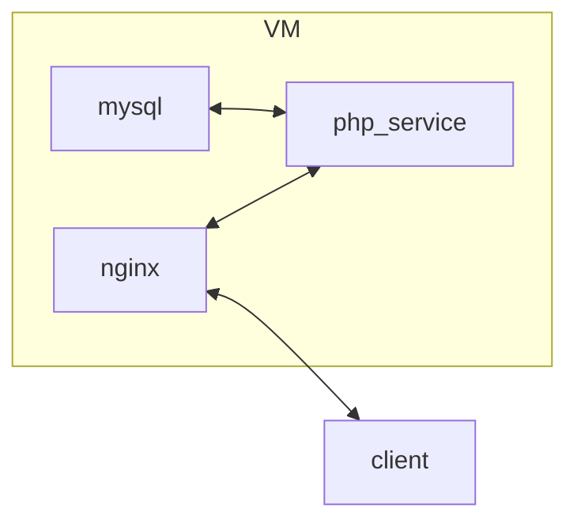

# Laravel Docker Template

This repository is a template to help setup medium-sized laravel application deployed in a docker container.

> For large application, consider using infrastructure as code tools to deploy your application on a virtual machine.



- `php_service` - php service
- `client` - your local machine
- `VM` - virtual machine (production)
- `nginx` - networking server
- `mysql` - mysql database

## Prerequisites

- PHP 8.2
- Composer ([phar file](https://getcomposer.org/download/))
- Docker

## Installation

To get started, copy the files in this repository to your project.

```bash
PROJECT_PATH=../laravel
cp Dockerfile docker-compose.yml .dockerignore .env.docker $PROJECT_PATH

cd $PROJECT_PATH
docker compose up -d
```

- [`Dockerfile`](.Dockerfile) - builds the docker image
- [`docker-compose.yml`](docker-compose.yml) - defines the network and services
- [`.dockerignore`](.dockerignore) - defines the files to be ignored by docker on build
- [`.env.docker`](./.env.docker) - defines the environment variables
- [`github/workflows/docker-release.yml`](.github/workflows/docker-release.yml) - defines the github actions for release

## Usage

To build the docker image, run the following command:

```bash
DOCKER_VERSION=$(jq -r '.version' composer.json)
DOCKER_DESCRIPTION=$(jq -r '.description' composer.json)
DOCKER_REPOSITORY=$(jq -r '.name' composer.json)

docker build \
  --build-arg DOCKER_VERSION=$DOCKER_VERSION \
  --build-arg DOCKER_DESCRIPTION=$DOCKER_DESCRIPTION \
  -t $DOCKER_REPOSITORY:$DOCKER_VERSION \
  -t $DOCKER_REPOSITORY:latest \
  .
```

To push your image to github container registry, run the following command:

```bash
DOCKER_VERSION=$(jq -r '.version' composer.json)
DOCKER_REPOSITORY=$(jq -r '.name' composer.json)

docker push $DOCKER_REPOSITORY:$DOCKER_VERSION
docker push $DOCKER_REPOSITORY:latest
```

> Note: Make sure your `composer.json` file is setup with the correct `name`, `version`, and `description`.

If you'd like to enable automatic docker releases for your repository, you can copy the [`github/workflows/docker-release.yml`](.github/workflows/docker-release.yml) file to your repository. This will automatically build and push a new docker each time you create a new tag. It uses the `name` and `version` field in the [`composer.json`](composer.json) file to determine the image tags.

```bash
cp .github/workflows/docker-release.yml ../laravel
```

Learn more in the [release section](#release) below.

### PHP Versions

To build for a specific PHP version, you can fork this repository and update the `FROM` line in the [`Dockerfile`](Dockerfile) to use the desired PHP version.

### Release

Versioning is handled by [`semantic-release`](https://github.com/semantic-release/semantic-release). To release a new build, you can bump the version in the [`composer.json`](composer.json) file and create a new GitHub release.

To update release conditions update the [`github/workflows/docker-release.yml`](.github/workflows/docker-release.yml) config.

## Contributing

Thank you for taking the time to contribute to this project! Contributions are what make the open-source community such an amazing place to learn, inspire, and create. Create an issue or submit a pull request to contribute.

### Security Vulnerabilities

If you discover a security vulnerability, please create a new issue on GitHub. All security vulnerabilities will be promptly addressed.

## License

The Laravel framework is open-sourced software licensed under the [MIT license](https://opensource.org/licenses/MIT).
